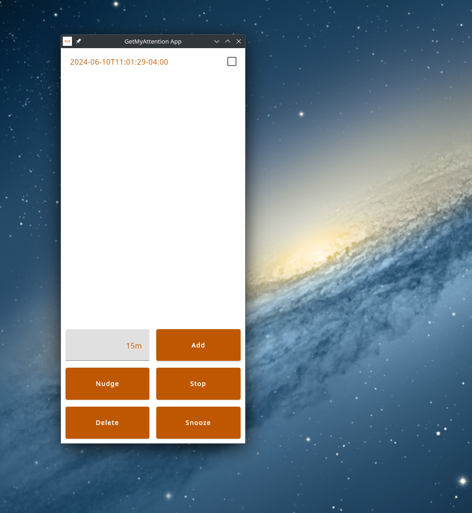
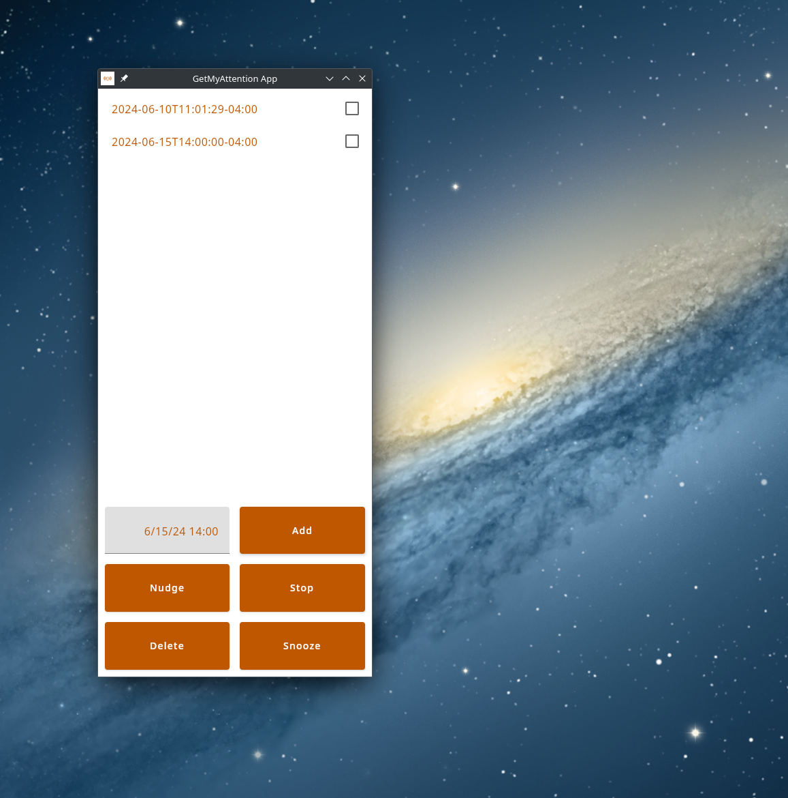

<h1>Welcome to GetMyAttention-App 👋</h1>

  
  
  

> The Kotlin Multiplatform app (client) component of the GetMyAttention system

## System diagram

## What is the project?

The GetMyAttention App is a Kotlin Multiplatform app that facilitates simple commands to the GetMyAttention Node via the GetMyAttention Server. Current multiplatform targets are Android and Desktop.

## What is the MVP?

* Submit date/time schedules to the server DONE
* View list of future schedules DONE
* Delete schedule(s) DONE

## What are the nice to haves?

* Nudge schedule(s) that are selected by a desired amount of minutes or hours DONE
* Stop alerts DONE
* Snooze an alert (i.e. stop all alerts and schedule an alert for 5 minutes out) DONE
* Reboot the server and node
* View a list of nodes
* View a list of nodes' behaviors
* Turn various behaviors off

## When will the project be complete?

The project will be complete once the app is successfully issuing commands to the Server.

## Media

Here are some screenshots of the app:

Figure 1: Android app icon

Figure 2: Android app showing three scheduled notifications

Figure 3: Android app showing use of time value instead of timestamp

Figure 4: Desktop app showing time value instead of timestamp

Figure 5: Desktop app showing timestamp notification

## Author

👤 **James Wilmoth**

* Website: https://me.hazaqames.com
* Twitter: [@hazaqames477](https://twitter.com/hazaqames477)
* Github: [@TitaniumCoder477](https://github.com/TitaniumCoder477)
* LinkedIn: [@hazaqames477](https://linkedin.com/in/hazaqames477)

## Show your support

Send me some crypto if this project helped you!

* Cardano ₳  : addr1q82dcyampgw4hgwjksjtcnntfld827094yf3p72e5gp4zd75msfmkzsatwsa9dpyh38xkn76w4u7t2gnzru4ngsr2ymsl62z78
* Solana ◎   : zdPPyKVmkimSj8a8Z13F8RBE6gosqDcatetjsHkTBev
* Ethereum Ξ : 0x63BA87D8A3Aa7aDB0B625Aa78c96Ca5b576556C8
* Bitcoin ₿  : bc1q4az7xep0znj5x4hrnyq8peu3qjxqtgeprns2jn

***
_This README was generated with ❤️ by [readme-md-generator](https://github.com/kefranabg/readme-md-generator)_
